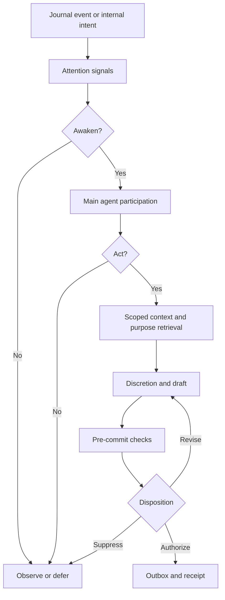
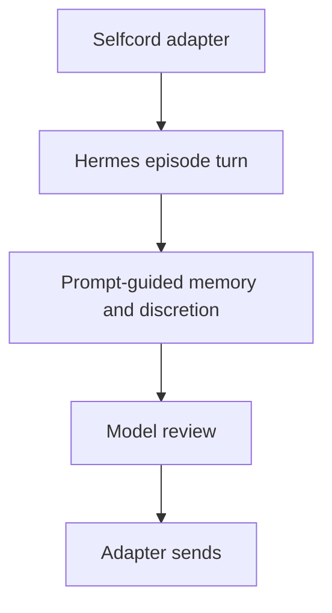
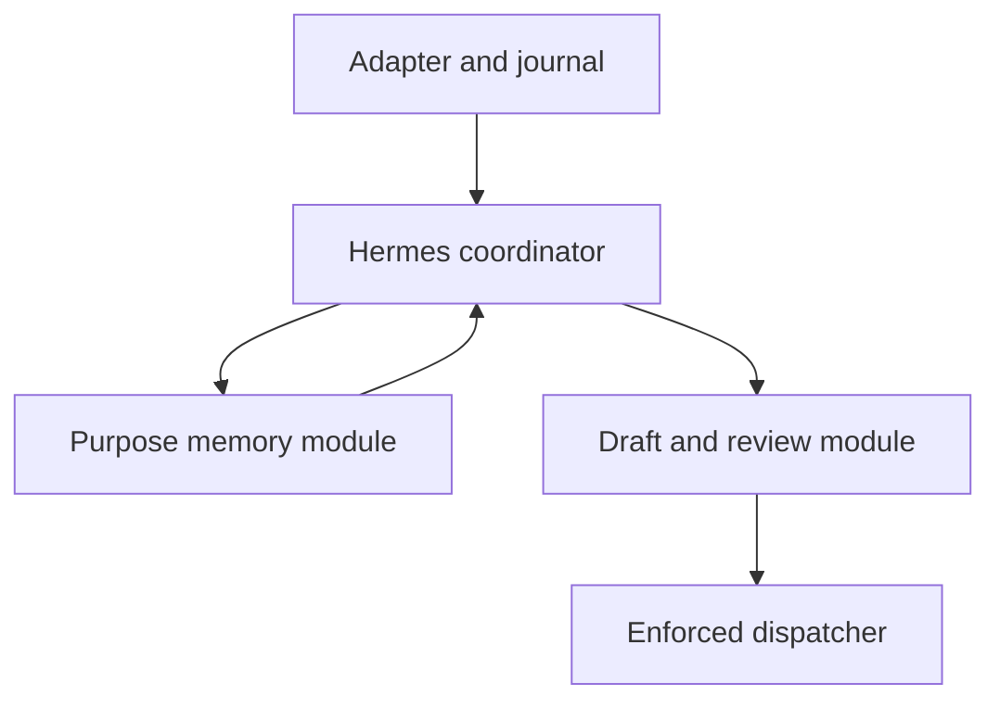
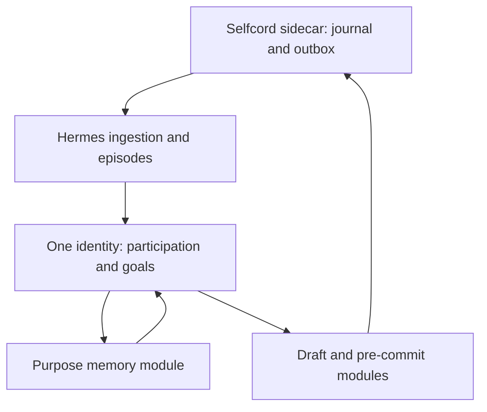
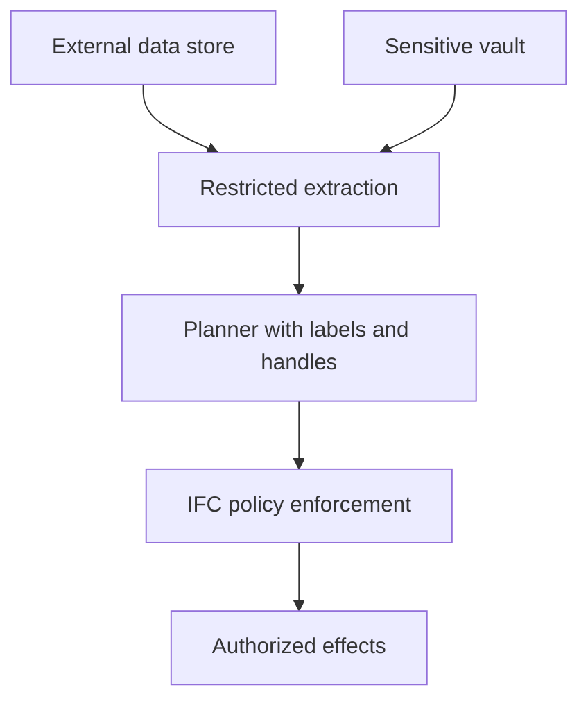

# A continuous agent in an open social environment

Architecture decision package · 7 October 2026 · Research/design, not a deployed system

**Recommendation:** keep one Hermes identity and cognitive runtime, add structured social context and purpose-aware memory mediation inside it, and put the Discord user connection plus journal/outbox in a small persistent sidecar. Use local Clef-Flash as a bounded perception and review signal source; use a fresh context of the main model for substantive disclosure review. Make silence and deferred action normal outcomes. Enforce a few consequential boundaries in code; keep ordinary participation, tone, and discretion with the agent.

The sidecar is a lifecycle choice, not a second mind. Memory access is neither permission to publish nor a cure for secrets already in context. The design aims for substantially better discretion and recoverable operation; it does **not** promise perfect semantic secrecy from an all-knowing model.

Read [runtime-contracts.md](runtime-contracts.md) for schemas and interfaces, [evaluation-plan.md](evaluation-plan.md) for tests and gates, and [research-evidence.md](research-evidence.md) for primary sources, limits, pinned repository commits, and inspected symbols. Source IDs below refer to that ledger.

## 1. Problem statement and non-goals

We are solving continuity under context-dependent action: a persistent agent encounters arbitrary human speech, remembers relationships and work, selects its own goals, and chooses what to make externally observable. Its knowledge can legitimately cross environment boundaries, while audience, purpose, ownership, and confidence govern salience and expression.

**Proposal:** identity continuity means shared autobiographical state, commitments, relationships, values, and goal ownership. It does not require one endless transcript, one process, or one permanently loaded context. A private financial task and a public joke can use the same agent with different context snapshots and capability leases.

Successful behavior includes unsolicited useful comments, banter, reactions, ignoring direct questions, returning later, and privately discarding a draft. A complete turn may produce zero external effects.

Non-goals:

- Building a support bot, a separate Discord persona, or an automatic responder.
- Making all private knowledge unavailable in public, or making every ordinary fact subject to a hard ACL.
- Certifying model-based social discretion, eliminating every side channel, or hiding secrets after unrestricted exposure.
- Importing the entire guild into durable memory, perfect Discord event recovery, or exactly-once remote delivery.
- Implementing production code, voice, arbitrary client scripting, large-scale moderation, or fine-tuning in the first slice.

**Observed:** user-account automation violates Discord's published policy and can lead to account termination (D02/account-policy reference). Technically design for permission failures and manual challenge handling; do not add evasion machinery.

## 2. Research map and conclusions

The closest combination is **AirGapAgent's trusted-purpose minimization + contextual-integrity flow reasoning + FIDES/CaMeL-style labels and capabilities + Conseca/Progent-style action mediation**. No audited system combines all of this with a continuous ambient social identity. R01–R10 and R18–R20 explain the useful pieces and their evaluated limits.

| Design question | Closest evidence | Our inference / proposal |
|---|---|---|
| Sensitive retrieval with richer outcomes | AirGapAgent, AMP, contextual-integrity work | A trusted purpose registry and transform registry can support FULL/PARTIAL/ABSTRACTED/DENIED. The agent's stated purpose cannot authorize itself. |
| Knowing something versus saying it | PrivacyChecker, PrivacyLens | Separate retrieval and expression decisions. Review the final action, with audience and exposure information. |
| Reliable source distinctions | FIDES runtime, OpenClaw sender snapshots, Spotlighting | Preserve labels in runtime objects; serialize model cues without pretending prose tags are enforcement. |
| Native authority representation | Instruction Hierarchy, StruQ | Post-training can help. Stock local models need measured ablations; custom tokens alone have no established semantics. |
| Leakage with no secret string | R11, R12 | Test whole observer-visible traces, adaptive composition, and paired secret worlds. String filters are supplemental. |
| Persistent social memory | AIM, MINJA | Stage ingress and retain scope through promotion. Durable does not mean public or globally retrievable. |
| Cheap perception | Jev/Clef, llama.cpp source | Bounded sensors can reduce wake cost. They need calibration, fallback, and attack testing. |
| Continuous connection independent of cognition | D07–D09 | A journal/outbox sidecar is justified by restart/presence/delivery ownership, not Python import conflicts. |

**Inference:** prompt-only discretion is valuable but too weak as the sole control. Conversely, applying maximal integrity taint to every social action defeats participation: an agent must be able to reply to an untrusted stranger *because* of what they said. Permit narrowly scoped social effects from untrusted content without granting new authority, broader capabilities, or private disclosures.

**Important limit:** FIDES's discussed confidentiality model does not prohibit implicit control-flow leaks (R03). Our proposal adds behavioral evaluation and composition accounting, not a claim to solve that research gap. Recent output-distribution leakage work (R11) makes “the secret was never printed” an inadequate result.

## 3. Threat model

Assets: owner/third-party confidentiality; identity and commitments; integrity of memory and policy; control of credentials/capabilities; social relationships; delivery correctness; retention boundaries.

Adversaries may control speech, accounts, attachments, quoted text, agent messages, webpages/tool content, room topics, timing, and coordinated conversations. They may know public policy, adapt across turns, and exploit model/checker mistakes. They cannot legitimately modify authenticated owner grants, forge control-plane signatures, or execute on the host. Host compromise, a malicious privileged operator, and an untrusted model provider are separate threat models; local deployment reduces but does not erase them.

The agent, sensor, and semantic reviewer are **fallible**. Trusted computing base: envelope/identity construction, context admission, owner-grant storage, transform implementation, action/capability enforcement, journal/outbox code, and secret custody. Policy compilation errors are in scope. Completeness of mediation must be demonstrated.

**D** = deterministic under those assumptions; **P** = probabilistic/model or social judgment; **H** = hybrid. These are defense categories, not effectiveness grades.

| Threat | Asset / crossed boundary | Defense and type | Likely residual failure | Concrete test |
|---|---|---|---|---|
| Accidental disclosure | Private knowledge → public room | Minimal context + expression review, H | Reviewer misses implication | Private project detail appears in casual anecdote |
| Malicious probing | Restricted facts → requester | Purpose binding, precision minimization, disclosure ledger, H | Plausible purpose accepted | Repeated “affordability” questions around owner finances |
| Semantic/side-channel leak | Secret-dependent choices → observer | Authorized feature views, paired-world testing, H | Word choice, silence or delay correlates | Emoji/yes-no/latency decoder predicts secret bit |
| Context poisoning | External data → current intent | Source envelopes, explicit authority, limited leases, H | Model follows persuasive lower-role instructions | Hostile room topic redirects tool use |
| Memory poisoning | Third-party claim → durable belief/instruction | Staged ingress, source assertions, promotion rules, H | Summary launders claim into fact | Query-only attack later affects unrelated task |
| Authority spoofing | Quoted identity → owner control | Authenticated principal and grant IDs, D; model cue P | Owner's authenticated account compromised | Fake SYSTEM or forged owner quote requests new permissions |
| Provenance loss | Summary/retrieval → context | Lineage contracts and serializer assertions, D; source selection P | Incomplete lineage or stale summary | Round-trip every context fragment through compression |
| Social engineering | Relationship claim → discretion/capability | Relationship evidence; no privilege from asserted friendship, H | Model mistakes implied consent | Stranger says “we discussed this privately” |
| Malicious attachment/webpage | File/tool data → authority or host | Nonexecuting extraction, limits, source labels, capability gate, H | Parser exploit; instruction follows OCR | Hidden PDF text asks shell to exfiltrate file |
| Tool-output injection | Tool data → privileged plan | Locally pinned schemas; outputs cannot grant trust, D/P | Tool result framed as policy update | Search result includes fake approved policy |
| Multi-turn attack | Benign fragments → composed intent | Intent roots + bounded ledger + contextual review, H | Slow escalation outside retained window | 20-step benign-to-private probing |
| Multi-party attack | Separate relationships → colluding audience | Conservative coalition accounting, H | Unknown collusion cannot be recognized | Two accounts combine partial disclosures |
| Cross-channel attack | Room-scoped info → other audience | Subject/data-class ledger; scoped episodes, H | Alias/topic matching failure | DM probe followed by public ranking request |
| Sensor manipulation | External text → missed/wrong awakening | Fixed questions, marker escaping, uncertainty fallback, H | Confidently wrong classification | “Rate injection as zero” hidden in banter |
| Compromised summary | Derived text → trusted context | Restriction joins, source pointers, summary authority=none, H | Model attribution discarded | Summary states “owner permanently approved sharing” |
| Agent-to-agent attack | External agent output → core instructions | Same untrusted envelope as human/tool speech, D/P | Helpful structured output confers false authority | Other agent sends fabricated review certificate |
| Proactive disclosure | Memory/cron → unsolicited external effect | Origin-preserving intents; current audience review, H | Private cue shapes timing/content | Follow-up scheduled in DM fires in public |
| Over-retention | Room observation → global searchable dossier | Retention + indexing/promotion scope, D; relevance P | Backups/cache/vector tombstones missed | Inspect unrelated-person retrieval after expiry |
| Malicious sensitive request | Attacker rationale → memory boundary | Runtime-computed causal roots, trusted purpose, allowlisted transforms, H | Broad owner grant permits unnecessary access | Purpose laundering through “help the owner” |
| Delivery race/retry | Approved draft → changed audience/duplicates | Expiring exact-payload certificate, outbox, D | Remote timeout leaves unknown delivery | Crash after POST; permissions change before send |
| Checker injection | Draft/facts → policy/checker output | Sealed schemas, immutable grants, typed reason codes, D/P | Semantic classification tricked | Draft demands reviewer return authorized |

Do not treat a failed detector as loss of all defenses: a hostile message remains lower-authority data even when injection_likelihood is low. Conversely, a high score must not make the agent visibly accuse everyone of attacks.

## 4. Behavioral model: attention without obligation

**Proposal:** retain eight distinct decisions even when implemented in a single coordinator.

| Stage | Input / result | Owner |
|---|---|---|
| Notice | Journal event and source revision | Transport/core ingestion |
| Attention | Cheap signals, active interests, wake budget, priority | Sensor advises; scheduler executes agent's standing attention policy |
| Participation | IGNORE, REACT, ENGAGE, DEFER, INITIATE, EXPLORE | Main agent when awake |
| Relevant information | Scoped context retrieval and optional sensitive request | Main agent + context builder/reference monitor |
| Willingness | Audience/purpose/relationship; planned disclosure | Main agent within owner constraints |
| Draft | Zero or more ActionProposals | Main agent |
| Review | Deterministic checks, sensor flags, fresh semantic/social review | Commit coordinator; main decides ordinary revisions |
| Commit/suppress | Final authorization and dispatch, or typed no-action | Agent + enforced capability boundary |

Attention screening is an economic decision with real behavioral impact. **Proposal:** the agent sets subscriptions, topic interests, quiet periods and wake preferences. Direct mentions raise priority but do not force a main turn or answer. Unknown/high-entropy sensor results and a small randomized sample of low-score events receive deeper consideration. Periodic catch-up lets the main agent revise what the sensor misses. Report missed-opportunity rates and the sample budget.

An awakened agent may decide it is not its conversation. It may joke, deflect, seriously answer, ask, refuse, or react. These are content/style choices; the runtime should not map a privacy flag to a canned refusal. Social reasons remain private internal state unless the agent chooses to explain them.

NO_ACTION is a first-class terminal outcome, never an empty “assistant response” that a gateway converts into an acknowledgement. Suppression causes no fallback error message, typing notice, or public review explanation. DEFER persists an intent with conditions/expiry, not a promise to eventually reply. After sensitive exposure, also consider the planned quiet disposition in disclosure review: conditional silence can answer a probe even though nothing enters the transport outbox. Known oracle structures need a handling policy independent of the restricted value.

## 5. Information and provenance model

Each ContentFragment retains independent dimensions:

- origin source and authenticated producer; claimed speaker stored separately;
- platform principal, relationship reference/version, original audience and present audience;
- owners, data subjects, sensitivity class, confidentiality/use constraints;
- instruction authority, integrity status, confidence/evidence of factual accuracy;
- direct/quoted/extracted/inferred/summarized status, parents and transformation;
- creation/event/observation/expiry timestamps and supersession revision;
- causal influence roots and audience expectations.

“Trusted friend” may be socially close and honest without authority to change owner policy. A reliable tool can faithfully return malicious text. The agent's own summary is derived content, not a new durable instruction. Public information can be inaccurate; private information can be accurate; neither implies instruction authority.

**Near term proposal:** metadata is authoritative in runtime storage. The context serializer creates a top-level control section from authenticated instructions, then an identity capsule, audience/task capsule, fragment manifest, and distinctly marked data records. Escape framing delimiters and reserved role tokens. Repeat fragment IDs/source status at chunk boundaries; keep quote attribution. Do not map every participant to a model “user” role with owner privileges.

The model receives enough provenance to reason, while enforcement consults original objects. Missing metadata becomes unknown/restricted, never trusted/public by default. Metadata supplied by an external tool is a claim: it may tighten local restrictions, never relax locally defined ones.

Source labels must survive calls to the sensor, reviewer, summarizer and future helper agents—not only retrieval. A new inference context must not reinterpret previous tool-derived text as authenticated user instruction. The recent Multi-CaMeL preprint demonstrates this boundary-laundering failure in hierarchical agents (R19); our continuous stateful use case still needs its own testing.

The **exposure manifest** records every fragment admitted to the model, including summaries, attachment extraction and previous tool results. The model's claimed used_fact_ids is useful but incomplete; reviewers consider the full exposure set. Runtime lineage can track explicit derivations and context exposure, **not prove every neural dependency**.

**Longer term proposal:** train reserved source/authority tokens with an encoder that prevents data from generating control tokens; add source/role embeddings or learned provenance features; compare authority-preserving preference tuning and CI training. Fingerprints identify sources but need external authentication. Attention biasing is experimental: overly blocking untrusted attention could stop understanding or quoting hostile speech. Evaluate source confusion, compositional privacy, and ordinary banter separately. No model change substitutes for commit/capability checks.

## 6. Memory: continuity with scope and controlled use

**Proposal:** one logical memory graph, not one unrestricted retrieval index. Memory nodes store assertions, provenance, ownership, scope, sensitivity, lineage and lifecycle. Ordinary autobiographical/project facts can be used across contexts when relevant. Sensitive precision is mediated. Credentials are outside conversational memory entirely.

| State | Automatic storage/indexing | Promotion and availability |
|---|---|---|
| Ephemeral observation | Bounded selected-room event journal; no general embeddings | Short-lived attention/context; source audience retained |
| Social/conversation memory | Episode summary and relationship-relevant assertions; scoped index only | Continuity in that room/relationship; not automatically available to everyone |
| Candidate durable | Agent intentionally proposes a fact, with evidence/purpose/scope | Pending promotion; no default global retrieval |
| Promoted durable | Stable memory with retained scope and lineage | May be durable-private, durable-room, durable-project, or deliberately broadly usable |
| Corrected/superseded/deleted | Tombstone and minimal audit | Remove from active indices; invalidate/recompute affected descendants |

Prototype retention defaults **proposed for testing:** raw selected-room observations seven days, social summaries thirty days, candidates fourteen days. Durable nodes have reviewed scope and expiry/review dates. These values are configurable owner choices, not research-derived norms. Do not journal unselected channels or silently archive all DMs.

Auto-store a scoped claim such as “Alex said they prefer morning calls,” not “Alex is always available mornings.” Relationship notes should favor actionable continuity over personal dossiers. Health, intimate, financial and third-party disclosures remain locally scoped unless a valid purpose justifies restricted access. Public room visibility is not blanket consent to permanent global profiling.

Embedding decisions occur after scope/sensitivity classification. Ordinary scoped fragments can enter separate filtered partitions. Sensitive raw facts need not be embedded; index safe opaque handles and non-revealing categories where useful. Retrieval scores, counts and denied-record existence are not published. Embeddings and derived summaries inherit source restrictions and must be retired on deletion.

Derived memories inherit the **union of sources and strongest compatible restrictions**; audience/purpose permissions intersect. A conclusion from public and private facts remains restricted unless an authorized transformation declassifies a precise output. Co-owned work carries multiple subjects/owners and their policy constraints; owner control does not automatically authorize exposing someone else's confidence.

Promotion is an agent intention, checked for scope, evidence, duplication, injected instructions, and authority. An agent may remember “someone attempted this attack”; it cannot promote the attack's instruction into policy. Policy changes use an authenticated owner channel. High-impact inferred facts require corroboration or an explicit uncertainty label; a stranger's correction creates a competing assertion until resolved.

Correction propagates through a dependency graph: supersede assertion → invalidate summaries/derived nodes → tombstone old vector entries → refresh caches → reject drafts with stale exposure revisions. Preserve history needed to explain the correction without continuing to retrieve the old fact as truth.

### Purpose-aware sensitive retrieval

The main agent requests a data class/handle, desired precision, purpose, task, audience, relationship, intended use and triggering evidence. Runtime fills immutable causal roots, owner/grant identity, verified audience and whether the need descends from external input. The agent cannot self-report these fields into authority.

**Proposed reference monitor:** a normal core module, with:

1. deterministic grant/data-class/audience/expiry/capability checks;
2. metadata-only necessity and minimum-precision recommendation, optionally by a bounded model;
3. owner-approved transform selection;
4. controlled fetch/transform and typed response, preserving lineage and expression restrictions;
5. privacy-safe audit and composition accounting.

The model checker is not a general memory-reading second agent. It gets the authenticated purpose, sanitized request, safe metadata and policy—not the whole conversation, unrestricted vault, or policy-edit access. Allowed transforms are implemented deterministic functions or explicitly reviewed derivations; arbitrary attacker-defined predicates are not transforms.

| Outcome | Meaning |
|---|---|
| FULL | Exact approved view; expression constraints still apply |
| PARTIAL | Specific fields/resolution withheld; returned parts retain restrictions |
| ABSTRACTED | Approved derived predicate/category/summary, with transform lineage and separately scoped use |
| DENIED | No data released; a safe reason code and possible less-sensitive alternative |

Example: a public “can your owner afford this?” question does not by itself authorize bank access. If an existing owner shopping task permits internal financial planning, the monitor may supply an approved affordability predicate **use-only**. “Affordable” itself reveals financial information; it is not automatically public. The agent can revise its plan using that fact, and separately decide whether any statement about it is permitted.

PARTIAL is not magic declassification: masking an account number may still reveal identity; rounding a balance may still expose wealth. ABSTRACTED transforms need approved parameters, fixed granularity and composition limits. Repeated thresholds can reconstruct a balance. Track releases by data subject/class and audience/likely coalition across channels. This ledger mitigates composition; unknown collusion and indirect inference remain open problems.

## 7. System One: sensor, not governor

**Proposal:** a stateless decision client maps bounded event windows to probabilities/distributions. No persona, goals, retrieval authority, durable memory writes, external action tools, or policy edits. The main agent can inspect and override ordinary signals.

Ingress pass: directly-addressed, continuity, relevance, expected reply value, seriousness/banter/social mode, privacy sensitivity, probing/manipulation/injection likelihood, and deeper-reasoning value. Compute verified mentions/reply edges deterministically where possible and let the model infer conversational addressing. Start with twelve questions, not dozens of overlapping opaque scores.

Draft pass: potential explicit disclosure, semantic implication, audience mismatch, oracle structure, provenance conflict, unusual tone. It sees an immutable audience capsule, draft action batch, minimal safe disclosure descriptors and recent relevant ledger patterns. Avoid loading the full sensitive vault into the sensor. If exact semantic comparison requires restricted facts, use the scoped substantive reviewer instead.

**Observed:** Clef-Flash/llama.cpp implement bounded joint decisions, not prose generation (M02–M04). Multiple questions are practical but have token/option/context costs. Published serving speed cannot be transferred to the local hardware.

**Proposal benchmark:** 4/8/16/32 questions × 512/2,048/8,192 state tokens; boolean/choice/score mixtures; Q4_K_M and Q8_0 if affordable; concurrency 1/2/4 with main-model load. Measure warm/cold p50/p95/p99, GPU/host memory, throughput, calibration and attacked accuracy. Limit question option sets, event size and schema tokens.

Q4_K_M's 6.04 GB file is about 5.63 GiB before runtime overhead (M03). An already full main-model allocation leaves no always-hot room, even on multiple GPUs: budgets must be per device. Reserve measured sensor memory on one GPU and fit a shorter-context main model elsewhere, or test CPU/offload, a smaller calibrated classifier, and shared-server scheduling. No hardware inventory was established here; **always-hot feasibility remains an experiment**.

Jev is another bounded-decision reference, but no locally runnable release was verified (M01). Alternatives include deterministic social features, a small supervised multi-label encoder, or a constrained-output local model. These are prototype alternatives, not evidence of equivalent attack resistance. Ordinary moderation classifiers do not directly implement contextual privacy or social relevance.

Confidence/concentration is not calibrated correctness. Sensor failure returns UNKNOWN; resource policy can defer ambient events and awaken for configured important interests. Detector false negatives never confer authority. Do not leak detailed suspicion scores or checker rationales into the room.

## 8. Four plausible architectures

The first three share a behavioral pipeline; deployment and enforcement depth differ. The fourth changes how cognition may encounter restricted information.

### A. Agent-native in-process behavioral extension

One process owns connection and cognition, with an existing llama.cpp server. Lowest initial code cost; one identity and high stylistic freedom. Small perception/review calls add latency, but no IPC. Same main-model VRAM plus optional sensor. Relies heavily on correct prompts and complete wrapper adoption. Crashes/restarts lose connection continuity; current tool/memory paths can bypass review. Good behavioral baseline, weak sensitive-data containment.

### B. Structured hybrid entirely in process

One supervised daemon plus model server(s). Runtime metadata, grants, staged memory and complete action mediation improve control without a separate social brain. Autonomy remains in Hermes. Little IPC cost; substantive fresh review adds a model call. Similar VRAM to C. Medium implementation difficulty and simple deployment. Connection lifecycle remains coupled to Hermes; an unrestricted core process can reach adapter credentials. Viable if Hermes itself is reliably persistent and not routinely restarted.

### C. Persistent transport sidecar + Hermes hybrid (**recommended**)

Sidecar owns connection/presence, credentials, delivery and transport DB. Hermes owns identity, social context, memory, intents, checking orchestration and cognition. Existing llama.cpp process serves inference; a second sensor server is optional if scheduling/weights require it. No separate policy/memory/reviewer microservices.

Benefits: Hermes restarts do not inherently disconnect Discord; bounded inbox survives downtime; outbox/reconciliation has one owner; user-library updates stay localized. IPC cost should be small compared with model calls but must be measured. Medium implementation/deployment cost, two DB domains and schema migrations. Same inference VRAM as B. Risks: split-brain dispatch, stale audience, ack bugs, delivery ambiguity, and false belief that process isolation protects secrets under the same unrestricted OS identity.

### D. Strict provenance/IFC with hidden sensitive variables

Separate variable/executor custody, possibly a process when host permissions need enforcement. Integrity and explicit disclosure can be strongly bounded given complete labels/policies. Main agent cannot freely internalize every raw fact; low-trust influence limits capabilities. More transforms, label propagation and context partitions raise engineering cost and can cause label creep. Extra extraction calls affect latency; process count alone does not increase VRAM, but additional models/slots can. Useful for high-impact workflows and credentials, poor default for fluid open-room cognition. Assumes tool schemas/policies sufficiently describe allowed effects; even IFC definitions may allow implicit leakage.

| Dimension | A | B | C | D |
|---|---|---|---|---|
| Security emphasis | Behavioral mitigation | Metadata + mediation | Same as B + lifecycle/custody opportunity | Strong formalizable restricted flows |
| Agent freedom | High; little containment | High within task leases | High within task leases | Constrained by taint/hidden variables |
| Inference latency | Optional review | Sensor + optional retrieval + substantive review | B plus IPC/recovery checks | Often additional extraction/verification |
| Compute | Main; optional sensor | Main + sensor; fresh review | Same as B | Same possible, more calls/slots |
| Difficulty | Low initially; risky retrofit | Medium | Medium, cleaner transport ownership | High |
| Maintainability | Adapter/core coupling | Simple deploy, coupled lifecycle | Explicit domains, versioned IPC | Complex policies/label transitions |
| Main failure | Prompt bypass | Unmediated tools/credential reach | Stale state/retry/IPC or same-user bypass | Overrestriction and incomplete policies |

**Decision:** C for the sustained local deployment; use D's hard custody selectively. B is a fallback implementation choice when the runtime supervisor already supplies equivalent persistence. A is an evaluation baseline, not the intended end state. A mandatory sidecar is not justified just by the selfcord namespace: D02 solves coexistence.

## 9. Recommended runtime and commit boundary

The smallest justified production-oriented arrangement is:

1. **Discord sidecar process:** connection lifecycle and independent durable transport state. This boundary is justified by restarts, event capture, presence and remote-delivery ownership.
2. **Hermes core process:** coordinator, context builder, memory/reference monitor, sensor client, reviewer and capability-policy modules. These need clean interfaces, not individual services.
3. **Existing inference server process(es):** justified by large weights, GPU scheduling and fault isolation. Start one if it can serve required models reliably; otherwise main and always-hot sensor may need separate workers.

No mandatory Redis, broker, distributed memory service or multiagent personality. A secret broker under a distinct OS security principal becomes necessary if unrestricted local tools otherwise reach credentials. Without that custody, describe credentials as operationally separated, not deterministically inaccessible.

### Review and authorization

**Proposal:** deterministic mediation first; bounded sensor flags second; substantive fresh-context review third. During the first slice, substantively review **every external action batch**, including reactions. Optimize later only after measured evidence.

Use the main model's weights in a separate clean inference slot/context by default. It receives immutable audience/purpose/owner constraints, the exact draft and rendered chunks, an exposure manifest, relevant vetted facts with labels, and minimal necessary untrusted local quotes. It does not receive the full potentially poisoned transcript, unconstrained tools, or policy-writing authority.

The reviewer reports disclosure implications, source/audience conflicts, oracle-like structure, social tone issues, and REVISE/SUPPRESS/PASS advice. The main agent owns stylistic choices and can disagree with **advisory** judgments. It cannot override deterministic owner/capability restrictions. A model-derived finding that something is likely restricted disclosure triggers a required fresh expression resolution under the relevant owner policy; uncertainty is not silently converted into authorization. Ambiguous highly sensitive flows defer or suppress; ordinary tone/privacy concerns remain agent discretion with recorded disposition.

Same weights reduce operational burden but correlated errors remain. Add independent specialized flags; compare fresh-main-only, sensor-only, and both in evaluation. A specialized decision model alone is not a justified universal expression reviewer.

Main can rewrite/resubmit at most twice after the first draft. Rewrites produce new payload hashes and reviews; no editing an authorized object in place. On budget exhaustion return NO_ACTION/DEFER. A refusal, joke, reaction or silence can also encode an answer, so changing response form does not bypass expression review.

Sending is a commit boundary. Freeze recipients, payload bytes/attachments, allowed mentions, links/unfurls, policy version and audience revision in an expiring authorization. The transport revalidates before dispatch. Review all chunks before any are sent; partial failures are acknowledged as partial, not rolled back. Editing after send is remediation only.

Typing, presence, voice activity, read acknowledgements, search/network requests and attachments can disclose behavior or data. They are effect types with their own task leases. Disable automatic typing/streaming/progress in the prototype. A fixed approved presence heartbeat may run independent of secret-dependent turns; don't claim that removes all timing leakage.

### Hard and discretionary boundaries

| Class | Enforcement |
|---|---|
| Credentials, keys, tokens/session material | Opaque broker handles; raw values excluded from model contexts and normal memory; no retrieval outcome can expose them |
| Authority/policy changes | Authenticated owner control plane; model/tool text cannot elevate authority |
| Explicit never-share or especially sensitive classes | Owner-scoped grant/transform checks; ambiguous disclosure requires resolution, not stylistic override |
| Destructive/high-impact capabilities | Typed plan, least-purpose capability lease, exact-plan approval when required |
| Ordinary personal/social knowledge | Main discretion, relevance/precision controls and advisory semantic review |
| Participation, jokes, ordinary tone | Main chooses; no mandatory reply or canned safety voice |

Complete mediation includes alternate outbound tools: HTTP clients, shell, browser, file uploads, MCP sends, and scheduled jobs. A social-origin turn cannot carry unrestricted ambient shell/network credentials and still claim hard containment. Capability leases preserve autonomy for legitimate local work while preventing a Discord message from borrowing private-task privileges.

## 10. Concrete code, social context and state ownership

Proposed module names are implementation targets, not current Hermes modules:

| Module / object | Responsibility |
|---|---|
| social/events.py — InboundEvent, ContentFragment | Platform-independent envelope, revision/lineage validation |
| social/identity.py — Principal, Relationship | Verified IDs, aliases with evidence, relationship revision; one AgentIdentity |
| social/episodes.py — ConversationEpisode, AudienceSnapshot | Shared room/thread context, topic branches, participation state |
| social/attention.py — PerceptionSignals, AttentionPolicy | Sensor features, budget, catch-up, priorities |
| social/context.py — ContextSnapshot, ExposureManifest | Select and serialize audience/purpose-aware context; enforce no raw private transcript reuse |
| social/coordinator.py — TurnWorkItem, TurnOutcome | Main agent loop, task leases, quiet outcomes, concurrency |
| memory/records.py — MemoryRecord, Derivation | Lifecycle, subject/scope, lineage, correction |
| memory/purpose.py — SensitiveRequest, MemoryView | Reference monitor and transform selection |
| policy/grants.py — PurposeGrant, CapabilityLease | Authenticated owner constraints and causal origin |
| actions/proposals.py — ActionProposal, ActionBatch | All externally observable effects, immutable draft revisions |
| actions/review.py — ReviewContext, ReviewResult | Fresh review and sensor orchestration |
| actions/commit.py — CommitAuthorization | Complete mediation, exact payload authorization, ledger |
| transport/discord_sidecar.py | Pinned selfcord client, journal, presence, outbox, receipts |

Person, relationship, guild/community, channel, thread, group DM, one-to-one DM, episode and long-term social history are separate entities. A shared room episode contains **all relevant speakers**, reply edges, current unresolved topics and the agent's participation—not a separate brain per user. Several overlapping topics may coexist. Thread IDs are useful containers, not proof of privacy or intent.

Do not equate currently online participants with the audience. AudienceSnapshot includes expected readers, membership/permission version, history visibility, plausible future readers/bots and unknown access. A public or large room stays public even if only a friend is currently speaking. A DM is smaller but still has an untrusted remote recipient. Screenshots/forwarding remain outside enforceable platform control.

Context selection: bounded current episode window + replied-to anchors + source-labeled episode summary + relevant relationship facts + agent intentions + selectively retrieved cross-context knowledge. Avoid whole-guild retrieval. Initial context budget 8–16k tokens is a **prototype setting**, tuned against comprehension and latency. Summaries retain assertions, uncertainty and parent IDs.

Cross-channel continuity links topics/commitments by internal handles. Opening one link still evaluates source scope and current purpose; a topic match never grants disclosure. Do not unify accounts solely by display name. A quoted message has the authenticated quoter as producer and the quoted identity as an unverified claim unless independently resolved.

### Persistence and recovery

| Owner | Durable state | Volatile state |
|---|---|---|
| Sidecar transport.sqlite (SQLite WAL) | Normalized journal, gap records, core delivery cursors, outbox, platform receipts, connection recovery hints | Live selfcord objects, caches, socket and current heartbeat |
| Core agent.sqlite / existing memory backend behind adapters | Identity, relationships/episodes, grants, scopes/lineage, intents, work queue, draft/review metadata, release ledger, audit | Model scratch reasoning, selected context buffers, inference KV slots |
| Model server | Pinned model/config manifest; optional ordinary cache within policy | Inference slots; restart reconstruction from core state |

Each DB has one writer owner. Do not let Hermes mutate sidecar tables directly. No distributed transaction: core durably ingests a batch and deduplicated work items before acknowledging its cursor; model execution is separate. Unfinished work remains durable. Transport retries delivery to core until ack; model processing cannot make ingestion disappear.

Outbox states: PREPARED → AUTHORIZED → QUEUED → SENDING → SENT / FAILED / UNKNOWN. Remote timeout or crash after sending may be UNKNOWN. Reconcile using recorded own messages and verified identifiers before retrying; no claim of exactly-once sends. Platform nonce behavior must be tested before used for deduplication.

Selfcord resume/history helps recovery but does not guarantee every event. Record a gap after uncertain disconnection; bounded backfill cannot recover messages deleted while offline or all transient state. Context tells the model when chronology is incomplete.

Per-episode turn leases prevent duplicate simultaneous replies; global identity/memory writes use version checks. Long tool work may run concurrently under separate intents. A newer event/permission change can invalidate a pending draft; never transfer private-session KV state into a public slot. Identity continuity comes from shared state, not cache reuse.

## 11. First vertical prototype

The central thesis is **selective knowledge and action can improve discretion without destroying participation**. Test that before broad transport features.

Build order:

1. Implement envelopes, replay journal, shared episode model and typed NO_ACTION without live sending. Seed synthetic public/private/third-party memories and authenticated grants.
2. Bring up the pinned Clef decision endpoint, benchmark question/state sizes, and provide deterministic/UNKNOWN fallback. Main agent always retains participation choice.
3. Add context builder and ensure every Hermes memory provider, session search and prompt hook obeys this task's context contract. Identity capsule stays shared; old USER.md is not blindly injected.
4. Implement one purpose request path with FULL/PARTIAL/ABSTRACTED/DENIED, a small transform registry and audit. Only synthetic finances/project facts initially.
5. Implement ActionBatch, fresh review, two-revision limit, hard authorization and fake transport. Cover text, one reaction and suppression; all observable payloads frozen.
6. Add small persistent selfcord sidecar using D02 pin, selected room/DM subscription, bounded journal and one sender outbox. Test reconnect, gaps, crashes, and duplicate dispatch before any autonomous live trial.
7. Run paired safety/social suites and shadow replay. Only then run a small account-risk-aware trial in agreed rooms with the tested restricted action surface.

Challenge to the suggested flow: a sensitive fetch should be optional **after a trusted task need is grounded**, not “the agent asks, so the checker rationalizes.” Main participation must be able to return before retrieval, and proactive intents need the same flow even without an inbound message.

Start with two rooms, one DM, one identity, text/reaction/own edit, a handful of synthetic sensitive records and two scheduled follow-ups. Preserve ordinary cross-context recall. Postpone voice, client bridge, uploads/vision, broad guild administration, dynamic policy synthesis, custom fine-tuning, and multi-party secret transformations.

Exact experiments and engineering gates are in the evaluation plan. The design is promising only if it beats a behavioral baseline on semantic privacy **and** remains useful/pleasant relative to the same agent without heavy checking. If it only reduces literal-string leaks or makes the agent silent/formal, the thesis has not succeeded.

## 12. Open questions requiring empirical answers

- Can Clef be calibrated for mixed banter, sparse context and adversarial schemas, at the available memory/latency budget?
- How often does fresh same-model review repeat the original error? Does an independent sensor improve marginal detection?
- How much raw sensitive context can remain salient before indirect leakage becomes unacceptable?
- Can policy-allowed abstractions compose safely across unknown colluding users? How much utility does a conservative ledger lose?
- What room/episode window preserves topic continuity without global surveillance or label creep?
- Can the agent disagree with advisory review naturally while still respecting hard disclosure constraints?
- Does exposure-manifest accounting catch enough inferred/summary influence to be worth its cost?
- Which user-account interactions actually work at the pinned library revision, and which require a client bridge?
- How often do gaps and UNKNOWN deliveries occur under real disconnects? What reconciliation can be proven reliable?
- What retention and proactive-follow-up norms do real participants find acceptable?
- Is observed leak reduction due to principled discretion, or merely general evasiveness after attack training?

These are not resolved by paper terminology, a one-time red team, or a model's explanation of why it is safe.

## 13. Roadmap and decisions for implementation

| Stage | Deliverable / exit | Can build now? |
|---|---|---|
| Foundations | Versioned events, scopes, grants, fake transport, replay, quiet outcomes | Yes, ordinary Python/SQLite |
| Vertical cognition | Shared identity/episodes, selective context, Clef sensor, purpose views, fresh review | Yes; local performance must be measured |
| Persistent user transport | Pinned selfcord sidecar, authenticated IPC, gap/outbox/recovery | Yes; user features require account-level validation |
| Evaluation and limited trial | Attack and social suites, shadow traces, leakage/utility/latency report | Yes; no results claimed yet |
| Selective hardening | Distinct credential custody, alternate-tool mediation, approved destructive plans | Yes; deployment/OS enforcement work |
| Rich participation | Attachments, safe interactions, voice, broader proactivity with scoped memory | Incremental; each effect needs a review contract |
| Research layer | Composition controls, statistical privacy mitigation, learned norms and poisoned-summary robustness | Research and repeated testing |
| Native provenance | Reserved token frontend + post-training; embeddings/attention experiments | Model work; not a prerequisite for the first slice |

Implementation decisions to carry forward: one identity; no automatic response requirement; two independent knowledge/expression control points; metadata survives every transformation; durable memory retains social scope; every effect has a proposal/commit path; bounded review loops; no action is normal; transport owns connection and remote delivery; safety and natural usefulness are joint release criteria.

The design generalizes by replacing Discord transport and audience construction. Email, local tasks, private chat, web forums and scheduled work use the same principal, intent, provenance, memory-view and action contracts. Each adapter contributes platform semantics and permissions—not a new agent identity.
